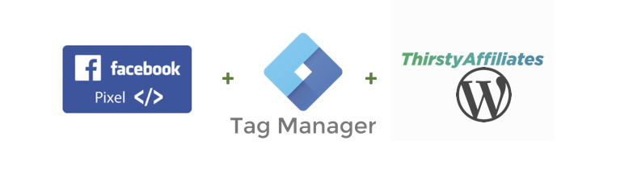
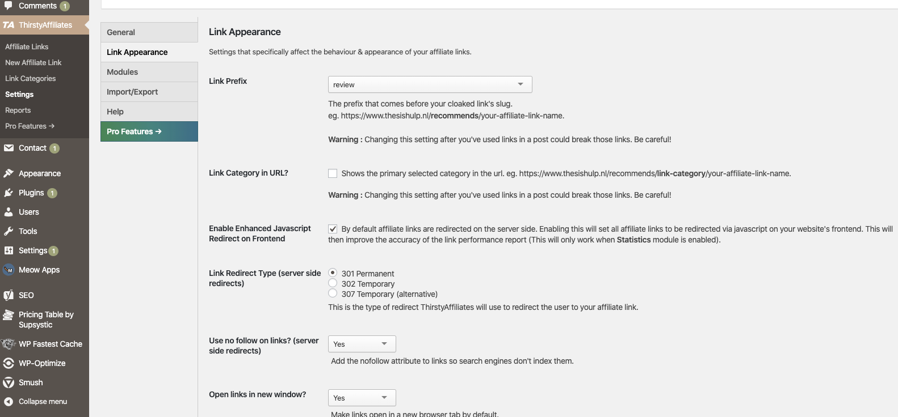
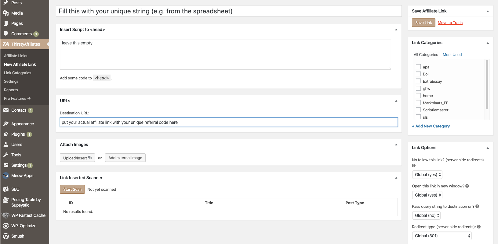
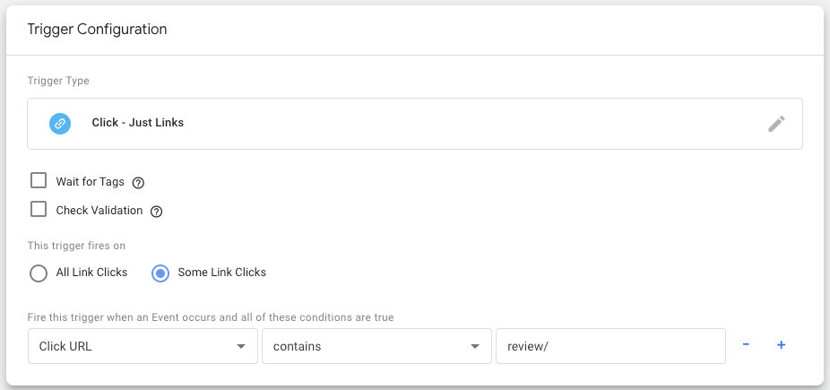
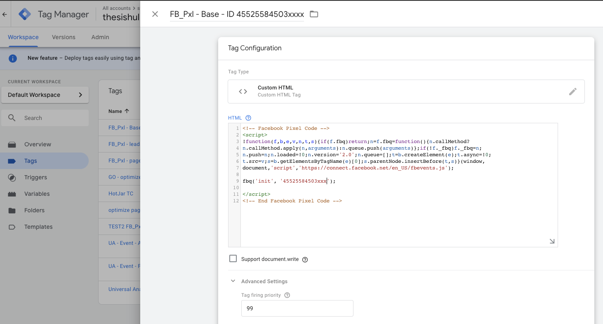

# How to leverage facebook ads’ ML to optimize on actual affiliate marketing leads instead of ad clicks or page landings. #

As most marketeers will know, running facebook(/instagram) ads directly towards your affiliate link (cloaked or open) can result in a ban. And probably rightfully so keeping UX in mind. This makes it a lot harder to correctly optimize facebook ads and targeting than it is for google ads. I have noticed that this causes a lot of affiliate marketeers to either allocate their resources exclusively towards google ads, or to use ad click (or page landings) as a proxy for leads (/affiliate link clicks) to optimize their facebook ads on.

So I want to share here the way I have been doing it. Please no that this entirely separate from my employment at facebook and is in no way endorsed by facebook or any of their representatives.
<br />
 
<br />

### Required tooling: ###
 
●	Tag Manager (I used Google Tag Manager (freemium))

●	Bulk Redirect Manager (I used the Thirsty Affiliates plugin for Wordpress (freemium))\

●	Facebook Pixel (free)

<br />

Another thing we need is strong converting (landing)page to function as an interstitial between the facebook ad and the website we are the affiliate for.
Best practice here is either to create a new page to perfectly match with the message and created expectations within your ads. Or just look at your analytics data and choose the page that has the highest % of affiliate link clicks.
<br />
<br />
<br />
#### The advantages of working with this interstitial landing page: ####

●	you can lead one ad to a page were several competing (affiliate) products can be compared and chosen by your visitors.  
●	These interstitial landing pages are way better to learn what your (potential) customer wants than just going by the facebook ad click data and insights. It goes without saying that these interstitial pages should have -at bare minimum- a good implementation of click stream analytics tooling (e.g. GA), something like hotjar and A/B testing tooling (e.g. Google Optimize, VWO or Optimizely) set up.  
●	Simply more room for for good content, and nudging practices. Take into account the flow, seeing the ad (copy + image + formed expectations) from their personal facebook to landing on this interstitial all the way to the pages from the website your are the affiliate for prior to actually converting.  
●	The main one as mentioned above; it simply prevents you as affiliate marketeer from getting banned from facebook ads..  
<br />


#### The downsides: ####
●	The interstitial is an extra step in the funnel; = increased attrition. This will always be at least partly true. Key is to make optimize the transition as much as possible by minimizing any friction on this interstitial, and using the extra content to increase the desire/motivation to convert on the page(s) to follow.  
●	Automated Ad optimization will not work. Or at least, the proxy you will need to use (landing or ad link licks) is a horrible predictor for actual leads (e.g. affiliate link clicks).  
<br />
<br />
Setting up the correct data pipeline (tracking + sending to your fb ad account) I am assuming here google tag manager and google analytics have already been implemented. For completeness I have added a link to a good guide on how to implement these two tools. 
<br />
<br />


	**Step 1**  *“installing GTM and GA”*<br /> 
  Install Google Tag Manager (and Google analytics)	Since a tag manager (should but) isn’t ubiquitous yet (especially for wordpress sites) 
	here is a link to a guide that explains how to implement google tag manager on a 
	wordpress site. https://www.wpbeginner.com/how-to....
<br />
<br />




**Step 2** (optional, *“link cloaking scheme”*)<br /> 
Create a systematic structure for link cloaking
This is not technically required, so this could be skipped if you are in a hurry.
Create a spreadsheet with one column with all your different affiliate programs (if you only have one still put down that name or abbreviation), a second column to the right of it expanding each affiliate program row with a one word rough descriptor like ‘header’ (or ‘hdr’), ‘body’ and ‘footer’, another column, expanding on each of these rows (mostly needed for the ‘body’ row) with ‘button’, ‘textlink’, ‘cta_link’, ‘cta_button’ etc. 
This will create (in this example (with 1 affiliate program) a 1 x 3 x 4 row scheme).  
You now concatenate these (e.g. with - in between) to get one unique string per ‘row’, and paste this in a new column to the right.  
The unique string should look something like “affiatename-body-cta_link”.
  
<br />
<br />


**Step 3** *“Link cloaking”*<br />
Link cloaking in wordpress. Install a redirect manager (e.g. thirsty affiliates) plugin on your wordpress site. 
After installing the plugin, go to setting within ‘thirsty affiliates’ (from the wordpress menu). Choose a link prefix. Choose a prefix that matches with you CTA (e.g. ‘recommends’ or ‘review’)

Other settings (optional)
- If you have more than one different affiliate link/product per page I would always suggest making links open in a new tab
- consider checking disable IP and other data collection options under the ‘general’ tab

Creating the actual links you will need.
Use the unique strings you just created in step 2 and your affiliate link final URLs given by your affiliate program provider to create your cloaked links (see screenshot).


(if you have skipped step 2, and just want a single link to rule them all (not ideal), put in a name that makes sense for you in the top field instead of the unique string, and continue)  
 
  

Clicking ‘Save link’ creates a your cloaked link. (Copy this link and put it in the column in your spreadsheet on the row of its used unique string ) 
Now do this for all rows in your spreadsheet.
<br />
<br />


**Step 4.**  *“GTM; creating the custom trigger”* <br /> 
Create a custom trigger that listens to clicks on the cloaked links.
Before installing the facebook Pixel we will create this custom trigger.
-	Go to ‘Triggers’ > ‘Create new trigger’ > Trigger `Configuration’  in the Tag Manager.
-	Choose ‘Just Links’  and check ‘Some Link Clicks’ option.
-	Choose ‘Click URL’ and select ‘contains’ and then type the chosen link prefix (from step 3, thirsty affiliates). E.g. ‘recommends/ or ‘review/’   
 

(this is where you can expand by creating different triggers per affiliate program because you started each unique string with the affiliate program/product name)
-	Give your trigger a logical name (e.g. “affiliate link click - aff.X”)

<br />
<br />


**Step 5.**  *“Facebook Pixel”*<br />
Installing the facebook Pixel.
To prevent some timing issues we will separate the facebook pixel code into three tags
(initializing the base code, the pageview push and the cloaked affiliate link click push):

-	Tag 1. Facebook Pixel ‘Base code’
Create a new custom HTML tag in google tag manager
Take the code provided for your facebook pixel, and take out the following part  
```
fbq('track', "PageView");  
```
Your code should now look like this (the number is unique to your account):  
```
<!-- Facebook Pixel Code -->
<script>
!function(f,b,e,v,n,t,s){if(f.fbq)return;n=f.fbq=function(){n.callMethod?
n.callMethod.apply(n,arguments):n.queue.push(arguments)};if(!f._fbq)f._fbq=n;
n.push=n;n.loaded=!0;n.version='2.0';n.queue=[];t=b.createElement(e);t.async=!0;
t.src=v;s=b.getElementsByTagName(e)[0];s.parentNode.insertBefore(t,s)}(window,
document,'script','https://connect.facebook.net/en_US/fbevents.js');
fbq('init', '45525584503xxx');
</script>  
<!-- End Facebook Pixel Code -->  
```
   
Put this in the HTML field and take ‘All Pages’ as trigger.
Fold open the ‘advanced settings’ and put in 99 (highest) in tag firing priority.


Select ‘All Pages’ as firing Trigger.

-	Tag 2. Facebook Pixel ‘pageview push’
	Create another tag (see tag 1) but use the following code in the HTML field instead:  
	```
	<script>
  	fbq('track', "PageView");
 	 </script>  
	 ```
	(this time leave tag firing priority empty)


-	Tag 3. Facebook Pixel (cloaked affiliate link click push)
Create another tag (see tag 1 and 2) but use the following code in the HTML field instead:  
```
<script>
 	 fbq('track', 'Lead', {
    value: 1,
    currency: ‘EUR’
  });
</script>  
```


(You can change the ‘Lead’ to something else, but to prevent issues with ‘ad objectives’ 
	you should pick something predefined like ‘Leads’ or ‘ . Leave tag firing priority empty.
I put value to 1 for test purposes but ideally you would the value of your total profit 
	divided by the total number of leads over the same period to function as an average 
	value, but it is not important for now. You can also leave value and currency out.)

Select the trigger you created before (the one that listens to url clicks containing 
	‘recommends/’) under ‘Triggering (firing triggers).

Save, submit, publish. 
<br />
<br />

## And you are done ##

Now when creating a new facebook ads campaign you are able to (after selecting ‘conversion’ as ad objective) select ‘Leads’ as event to optimize on. 
This makes the facebook ML algorithms optimize on actually finding the best placements, timing and targeting combinations for clicks on your actual affiliate links (‘leads’) -after landing on your interstitial landing page-  instead of just optimizing on clicks on your ads or landings on your page.

Hope this helps any (affiliate) marketeer who -like me- was struggling with getting fb ads to optimize properly!

